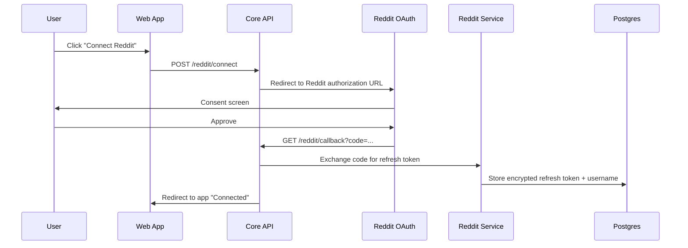
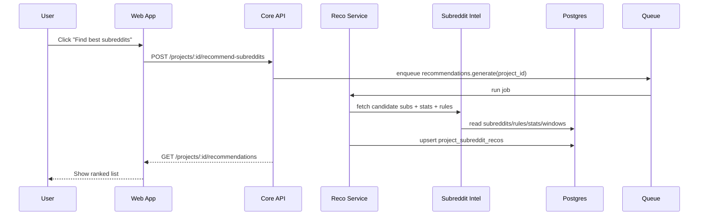
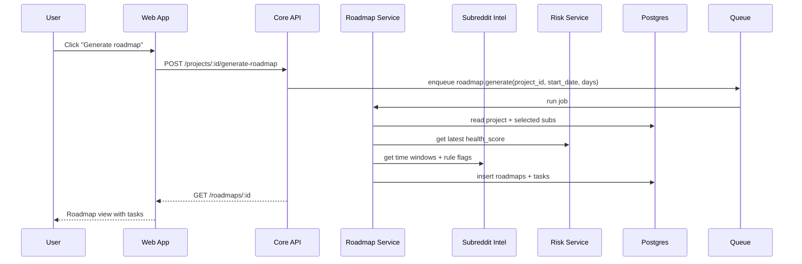
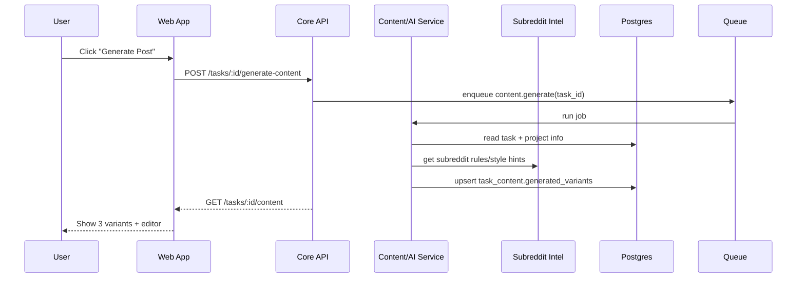
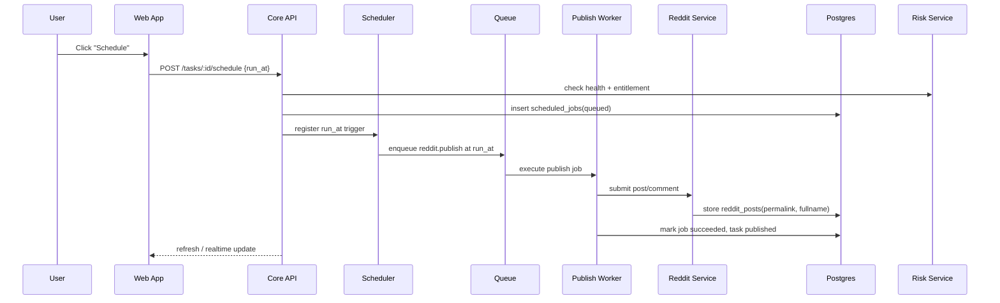
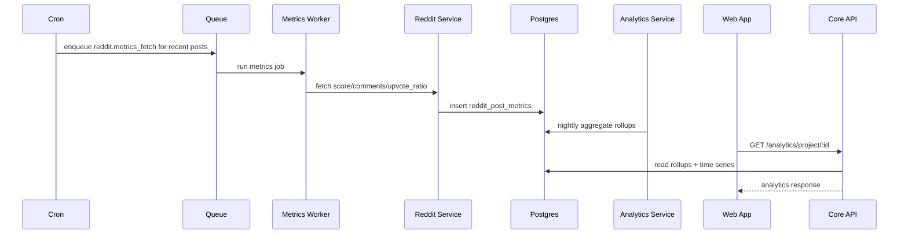
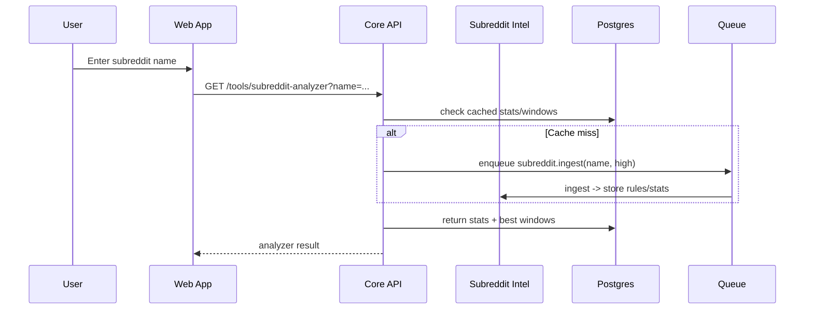
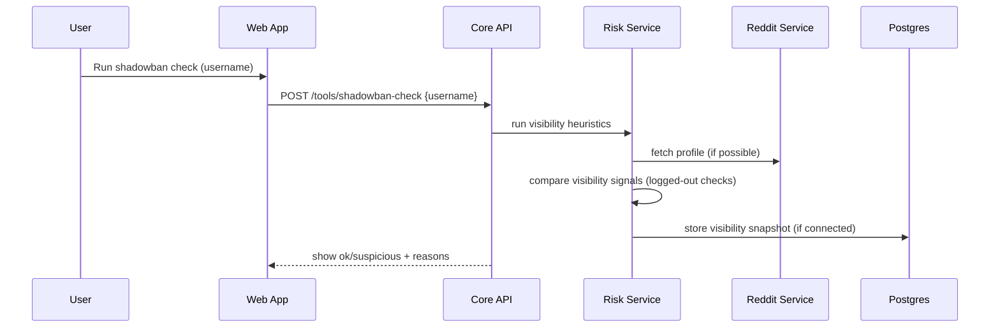

# MediaFast-style Product — Complete System Design Report

**Date:** 2026-01-31  
**Timezone:** Asia/Kolkata  
**Scope:** A feature-complete, MediaFast-like SaaS for Reddit marketing: subreddit discovery, best-time windows, roadmap tasks, AI content generation, scheduling/auto-posting, analytics, smart post finder, and account health/shadowban inference — plus public free tools and SEO content engine.

---

## 0) Executive Summary

This document specifies a production-ready blueprint for building a MediaFast-style platform:

- **Microservices**: exact service list with responsibilities.
- **Data model**: Postgres SQL schema (MVP+).
- **Queues/Jobs**: payloads, retry policy, cron triggers.
- **Sequence diagrams**: end-to-end flows for each feature.
- **Infra sizing**: MVP vs scale assumptions.
- **Clone checklist**: every screen and API required to reach feature parity (functional equivalence).

> Note: This describes a _functionally similar_ product. It does not require copying UI/branding/copy.

---

## 1) Architecture Overview

### 1.1 Core ideas

- Recommendations are driven by a **subreddit intelligence store** (metadata, rules, engagement stats, time windows).
- A **roadmap engine** converts those insights into actionable daily tasks.
- A **scheduler + worker fleet** safely executes scheduled posts/comments with retries and rate limiting.
- An **analytics pipeline** continuously fetches performance, feeds back into time-window scoring.
- A **risk/account health module** detects likely removals and shadowban-like visibility anomalies.

### 1.2 High-level component map

- **Web App (Next.js/React)**: landing, SEO, free tools, and logged-in app.
- **Core API**: auth, projects, tasks, orchestration.
- **Reddit Service**: OAuth, posting, commenting, reading.
- **Subreddit Intel**: ingestion + best-time windows + stats.
- **Roadmap & Recommendation Service**: best 5 subreddits + daily tasks.
- **AI Content**: post/comment generation + rewriting + filters.
- **Scheduler + Workers**: run-at-time jobs, retries, idempotency.
- **Analytics**: time series + rollups + dashboards.
- **Risk/Health**: rule conflicts, removals, visibility checks.
- Optional: **Notifications**, **Chat/Community**, **Search**.

---

## 2) Exact Microservices List + Responsibilities

### 2.1 Edge Web (Landing + App UI)

**Tech:** Next.js / Remix  
**Responsibilities**

- Marketing pages + SEO pages (city/industry/tools/alternatives)
- Free tools pages (post generator, analyzer, shadowban)
- Logged-in UI (projects, roadmap, tasks, scheduler, analytics)
- Calls Core API; optional realtime via WebSocket/SSE

---

### 2.2 API Gateway / Core Backend

**Tech:** Node (NestJS/Fastify) or Go  
**Responsibilities**

- Auth/session + RBAC
- CRUD: users, reddit accounts, projects, roadmaps, tasks
- Orchestrates downstream services
- Billing entitlement checks (plan limits)
- Idempotency keys, validation, audit logs
- Public tool endpoints (rate-limited)

---

### 2.3 Auth Service (Optional; can be merged into Core API in MVP)

**Responsibilities**

- Signup/login/reset
- Social login (Google)
- JWT/session issuance + rotation
- MFA (later)

---

### 2.4 Billing Service

**Responsibilities**

- Stripe Checkout + Webhooks
- Plans/entitlements: max projects, scheduled posts/month, AI gens/day
- Lifetime plan logic
- Upgrade/downgrade/cancel

---

### 2.5 Reddit Integration Service

**Responsibilities**

- OAuth connect/callback, refresh token rotation
- Reddit API client with **strict rate limiting**
- Operations:
  - submit post/comment
  - fetch subreddit info/rules (if supported)
  - fetch user profile, post metrics
- Stores encrypted tokens (KMS or envelope encryption)

---

### 2.6 Subreddit Intelligence Service

**Responsibilities**

- Subreddit catalog + metadata
- Rules ingestion + parsing into derived flags
- Activity/engagement stats
- Best-time windows heatmaps/models
- Risk score: strictness, promo tolerance, inferred removals

---

### 2.7 Roadmap & Recommendation Service

**Responsibilities**

- Candidate generation + ranking: “Best 5 subreddits”
- Roadmap generation: daily post/comment tasks
- Smart post finder: comment opportunities feed
- Applies constraints: rules, account health, cadence

---

### 2.8 Content / AI Service

**Responsibilities**

- Generate post/comment variants (3+)
- Rewrite, shorten, change tone
- Quality/safety filters:
  - spammy phrases
  - too many links
  - repeated brand mentions
  - subreddit-specific constraints
- Prompt template versioning and A/B testing

---

### 2.9 Scheduler / Job Orchestrator

**Responsibilities**

- Accepts run-at timestamps
- Enqueues execution jobs at the right time
- Idempotency & dedup
- Retries + backoff
- Dead-letter + alerting
- Cron triggers for periodic ingestion/metrics

---

### 2.10 Worker Fleet (Execution Workers)

**Responsibilities**

- Publish scheduled posts/comments
- Fetch metrics
- Ingest subreddits
- Compute time windows
- Run account health + visibility checks
- Stateless and horizontally scalable

---

### 2.11 Analytics Service

**Responsibilities**

- Aggregates per project/subreddit/time-window
- Stores time series and rollups
- Powers dashboards
- Feedback loop to Subreddit Intel for scoring updates

---

### 2.12 Risk & Account Health Service

**Responsibilities**

- Account health score
- Removal/automod pattern inference
- Shadowban-like inference via visibility checks
- Blocks/limits risky actions

---

### 2.13 Notifications (Optional)

**Responsibilities**

- Email + in-app notification feed
- Job failure alerts, publish confirmation, reminders
- Realtime updates (SSE/WebSocket)

---

### 2.14 Community/Chat (Optional)

**Responsibilities**

- Community channels + moderation
- MVP alternative: embed Discord/Slack

---

## 3) Data Model (Postgres) — SQL Schema (MVP+)

> Copy/paste into a migration. Uses `pgcrypto` + `citext`.

```sql
-- Enable useful extensions
CREATE EXTENSION IF NOT EXISTS pgcrypto;
CREATE EXTENSION IF NOT EXISTS citext;

-- =========================
-- USERS / AUTH / BILLING
-- =========================

CREATE TABLE users (
  id                UUID PRIMARY KEY DEFAULT gen_random_uuid(),
  email             CITEXT UNIQUE NOT NULL,
  password_hash     TEXT,
  name              TEXT,
  created_at        TIMESTAMPTZ NOT NULL DEFAULT now(),
  updated_at        TIMESTAMPTZ NOT NULL DEFAULT now()
);

CREATE TABLE sessions (
  id                UUID PRIMARY KEY DEFAULT gen_random_uuid(),
  user_id           UUID NOT NULL REFERENCES users(id) ON DELETE CASCADE,
  refresh_token_hash TEXT NOT NULL,
  user_agent        TEXT,
  ip                INET,
  created_at        TIMESTAMPTZ NOT NULL DEFAULT now(),
  expires_at        TIMESTAMPTZ NOT NULL
);

CREATE TABLE plans (
  id                TEXT PRIMARY KEY,           -- e.g. "monthly", "lifetime"
  name              TEXT NOT NULL,
  price_cents       INTEGER NOT NULL,
  currency          TEXT NOT NULL DEFAULT 'USD',
  max_projects      INTEGER NOT NULL,
  max_scheduled_per_month INTEGER NOT NULL,
  max_ai_gen_per_day INTEGER NOT NULL,
  created_at        TIMESTAMPTZ NOT NULL DEFAULT now()
);

CREATE TABLE subscriptions (
  id                UUID PRIMARY KEY DEFAULT gen_random_uuid(),
  user_id           UUID NOT NULL REFERENCES users(id) ON DELETE CASCADE,
  plan_id           TEXT NOT NULL REFERENCES plans(id),
  status            TEXT NOT NULL,              -- active, canceled, past_due, trialing
  stripe_customer_id TEXT,
  stripe_sub_id     TEXT,
  current_period_end TIMESTAMPTZ,
  created_at        TIMESTAMPTZ NOT NULL DEFAULT now(),
  updated_at        TIMESTAMPTZ NOT NULL DEFAULT now()
);

-- =========================
-- REDDIT ACCOUNTS / TOKENS
-- =========================

CREATE TABLE reddit_accounts (
  id                UUID PRIMARY KEY DEFAULT gen_random_uuid(),
  user_id           UUID NOT NULL REFERENCES users(id) ON DELETE CASCADE,
  reddit_username   TEXT NOT NULL,
  reddit_user_id    TEXT,                       -- reddit "t2_xxx" if available
  token_ciphertext  BYTEA NOT NULL,             -- encrypted refresh token
  token_iv          BYTEA NOT NULL,
  token_kid         TEXT NOT NULL,              -- key id if using KMS
  scopes            TEXT[] NOT NULL DEFAULT '{}',
  last_validated_at TIMESTAMPTZ,
  created_at        TIMESTAMPTZ NOT NULL DEFAULT now(),
  UNIQUE(user_id, reddit_username)
);

-- =========================
-- PROJECTS
-- =========================

CREATE TABLE projects (
  id                UUID PRIMARY KEY DEFAULT gen_random_uuid(),
  user_id           UUID NOT NULL REFERENCES users(id) ON DELETE CASCADE,
  name              TEXT NOT NULL,
  product_url       TEXT,
  product_desc      TEXT NOT NULL,
  target_audience   TEXT,
  tone              TEXT,                       -- e.g. "casual", "technical"
  goals             JSONB NOT NULL DEFAULT '{}'::jsonb,  -- e.g. {"traffic":true,"feedback":true}
  created_at        TIMESTAMPTZ NOT NULL DEFAULT now(),
  updated_at        TIMESTAMPTZ NOT NULL DEFAULT now()
);

-- =========================
-- SUBREDDIT CATALOG + INTELLIGENCE
-- =========================

CREATE TABLE subreddits (
  id                BIGSERIAL PRIMARY KEY,
  name              CITEXT UNIQUE NOT NULL,      -- "startups"
  title             TEXT,
  description       TEXT,
  nsfw              BOOLEAN NOT NULL DEFAULT false,
  subscribers       BIGINT,
  created_at        TIMESTAMPTZ NOT NULL DEFAULT now(),
  updated_at        TIMESTAMPTZ NOT NULL DEFAULT now()
);

CREATE TABLE subreddit_rules (
  subreddit_id      BIGINT PRIMARY KEY REFERENCES subreddits(id) ON DELETE CASCADE,
  rules_json        JSONB NOT NULL,
  derived_flags     JSONB NOT NULL DEFAULT '{}'::jsonb, -- promo_allowed, link_allowed, etc
  fetched_at        TIMESTAMPTZ NOT NULL DEFAULT now()
);

CREATE TABLE subreddit_stats_daily (
  subreddit_id      BIGINT NOT NULL REFERENCES subreddits(id) ON DELETE CASCADE,
  day               DATE NOT NULL,
  posts_count       INTEGER NOT NULL DEFAULT 0,
  avg_score         REAL NOT NULL DEFAULT 0,
  avg_comments      REAL NOT NULL DEFAULT 0,
  median_first_hour_comments REAL NOT NULL DEFAULT 0,
  removal_rate      REAL NOT NULL DEFAULT 0,     -- if you can infer
  PRIMARY KEY (subreddit_id, day)
);

-- Best-time heatmap: engagement score by DOW + hour (0-23)
CREATE TABLE subreddit_time_windows (
  subreddit_id      BIGINT NOT NULL REFERENCES subreddits(id) ON DELETE CASCADE,
  dow               SMALLINT NOT NULL CHECK (dow BETWEEN 0 AND 6),
  hour              SMALLINT NOT NULL CHECK (hour BETWEEN 0 AND 23),
  predicted_engagement REAL NOT NULL,
  model_version     TEXT NOT NULL DEFAULT 'v1',
  updated_at        TIMESTAMPTZ NOT NULL DEFAULT now(),
  PRIMARY KEY (subreddit_id, dow, hour)
);

-- Optional: embeddings for semantic search (or use pgvector)
CREATE TABLE subreddit_embeddings (
  subreddit_id      BIGINT PRIMARY KEY REFERENCES subreddits(id) ON DELETE CASCADE,
  embedding         BYTEA NOT NULL,
  updated_at        TIMESTAMPTZ NOT NULL DEFAULT now()
);

-- =========================
-- RECOMMENDATIONS / ROADMAP / TASKS
-- =========================

CREATE TABLE project_subreddit_recos (
  id                UUID PRIMARY KEY DEFAULT gen_random_uuid(),
  project_id        UUID NOT NULL REFERENCES projects(id) ON DELETE CASCADE,
  subreddit_id      BIGINT NOT NULL REFERENCES subreddits(id) ON DELETE CASCADE,
  fit_score         REAL NOT NULL,
  risk_score        REAL NOT NULL,
  reasons           JSONB NOT NULL DEFAULT '{}'::jsonb,
  created_at        TIMESTAMPTZ NOT NULL DEFAULT now(),
  UNIQUE(project_id, subreddit_id)
);

CREATE TABLE roadmaps (
  id                UUID PRIMARY KEY DEFAULT gen_random_uuid(),
  project_id        UUID NOT NULL REFERENCES projects(id) ON DELETE CASCADE,
  start_date        DATE NOT NULL,
  end_date          DATE NOT NULL,
  settings          JSONB NOT NULL DEFAULT '{}'::jsonb,   -- cadence, constraints
  created_at        TIMESTAMPTZ NOT NULL DEFAULT now()
);

CREATE TYPE task_type AS ENUM ('post', 'comment');
CREATE TYPE task_status AS ENUM ('draft', 'ready', 'scheduled', 'published', 'failed', 'skipped');

CREATE TABLE tasks (
  id                UUID PRIMARY KEY DEFAULT gen_random_uuid(),
  roadmap_id        UUID NOT NULL REFERENCES roadmaps(id) ON DELETE CASCADE,
  project_id        UUID NOT NULL REFERENCES projects(id) ON DELETE CASCADE,
  type              task_type NOT NULL,
  subreddit_id      BIGINT REFERENCES subreddits(id),
  target_permalink  TEXT,                         -- for comment tasks
  suggested_prompt  TEXT,
  status            task_status NOT NULL DEFAULT 'draft',
  scheduled_for     TIMESTAMPTZ,
  created_at        TIMESTAMPTZ NOT NULL DEFAULT now(),
  updated_at        TIMESTAMPTZ NOT NULL DEFAULT now()
);

CREATE TABLE task_content (
  task_id           UUID PRIMARY KEY REFERENCES tasks(id) ON DELETE CASCADE,
  generated_variants JSONB NOT NULL DEFAULT '[]'::jsonb,  -- array of {title, body}
  final_title       TEXT,
  final_body        TEXT,
  last_generated_at TIMESTAMPTZ
);

-- =========================
-- SCHEDULING / JOBS / POSTS / METRICS
-- =========================

CREATE TYPE job_status AS ENUM ('queued','running','succeeded','failed','dead');

CREATE TABLE scheduled_jobs (
  id                UUID PRIMARY KEY DEFAULT gen_random_uuid(),
  task_id           UUID NOT NULL REFERENCES tasks(id) ON DELETE CASCADE,
  run_at            TIMESTAMPTZ NOT NULL,
  status            job_status NOT NULL DEFAULT 'queued',
  attempts          INTEGER NOT NULL DEFAULT 0,
  max_attempts      INTEGER NOT NULL DEFAULT 5,
  last_error        TEXT,
  idempotency_key   TEXT NOT NULL,               -- e.g. task_id + action
  created_at        TIMESTAMPTZ NOT NULL DEFAULT now(),
  updated_at        TIMESTAMPTZ NOT NULL DEFAULT now(),
  UNIQUE(idempotency_key)
);

CREATE TABLE reddit_posts (
  id                UUID PRIMARY KEY DEFAULT gen_random_uuid(),
  task_id           UUID NOT NULL REFERENCES tasks(id) ON DELETE CASCADE,
  reddit_account_id UUID NOT NULL REFERENCES reddit_accounts(id) ON DELETE CASCADE,
  reddit_fullname   TEXT NOT NULL,               -- t3_xxx or t1_xxx
  permalink         TEXT NOT NULL,
  created_at        TIMESTAMPTZ NOT NULL DEFAULT now(),
  removed_flag      BOOLEAN NOT NULL DEFAULT false,
  removed_reason    TEXT
);

CREATE TABLE reddit_post_metrics (
  id                UUID PRIMARY KEY DEFAULT gen_random_uuid(),
  reddit_post_id    UUID NOT NULL REFERENCES reddit_posts(id) ON DELETE CASCADE,
  captured_at       TIMESTAMPTZ NOT NULL DEFAULT now(),
  score             INTEGER NOT NULL DEFAULT 0,
  upvote_ratio      REAL,
  num_comments      INTEGER NOT NULL DEFAULT 0
);

-- =========================
-- COMMENT OPPORTUNITIES
-- =========================

CREATE TABLE comment_opportunities (
  id                UUID PRIMARY KEY DEFAULT gen_random_uuid(),
  subreddit_id      BIGINT NOT NULL REFERENCES subreddits(id) ON DELETE CASCADE,
  reddit_fullname   TEXT NOT NULL,               -- t3_xxx
  permalink         TEXT NOT NULL,
  opportunity_score REAL NOT NULL,
  title             TEXT,
  created_utc       TIMESTAMPTZ,
  fetched_at        TIMESTAMPTZ NOT NULL DEFAULT now()
);

-- =========================
-- ACCOUNT HEALTH / VISIBILITY CHECKS
-- =========================

CREATE TABLE account_health_snapshots (
  id                UUID PRIMARY KEY DEFAULT gen_random_uuid(),
  reddit_account_id UUID NOT NULL REFERENCES reddit_accounts(id) ON DELETE CASCADE,
  captured_at       TIMESTAMPTZ NOT NULL DEFAULT now(),
  health_score      REAL NOT NULL,
  signals_json      JSONB NOT NULL DEFAULT '{}'::jsonb
);

CREATE TABLE visibility_checks (
  id                UUID PRIMARY KEY DEFAULT gen_random_uuid(),
  reddit_account_id UUID NOT NULL REFERENCES reddit_accounts(id) ON DELETE CASCADE,
  permalink         TEXT NOT NULL,
  checked_at        TIMESTAMPTZ NOT NULL DEFAULT now(),
  visible_logged_in BOOLEAN,
  visible_logged_out BOOLEAN,
  visible_alt        BOOLEAN,
  result            TEXT                         -- ok, suspicious, failed
);

-- =========================
-- NOTIFICATIONS (OPTIONAL)
-- =========================

CREATE TABLE notifications (
  id                UUID PRIMARY KEY DEFAULT gen_random_uuid(),
  user_id           UUID NOT NULL REFERENCES users(id) ON DELETE CASCADE,
  type              TEXT NOT NULL,               -- job_failed, published, reminder
  payload           JSONB NOT NULL,
  read_at           TIMESTAMPTZ,
  created_at        TIMESTAMPTZ NOT NULL DEFAULT now()
);

-- Helpful indexes
CREATE INDEX idx_tasks_project_status ON tasks(project_id, status);
CREATE INDEX idx_jobs_runat_status ON scheduled_jobs(run_at, status);
CREATE INDEX idx_metrics_post_time ON reddit_post_metrics(reddit_post_id, captured_at);
CREATE INDEX idx_opps_sub_score ON comment_opportunities(subreddit_id, opportunity_score DESC);
```

---

## 4) Queue / Job Definitions (Exact)

**Recommendation (MVP):** BullMQ (Redis).  
**Scale:** SQS or Kafka + worker pools.

### 4.1 Queues

#### Queue: `reddit.publish`

**Purpose:** Publish scheduled post/comment.  
**Payload**

```json
{
  "job_id": "uuid",
  "task_id": "uuid",
  "reddit_account_id": "uuid",
  "type": "post|comment",
  "idempotency_key": "task:<uuid>:publish",
  "run_at": "ISO"
}
```

**Retry**

- max_attempts: 5
- backoff: 1m, 5m, 15m, 1h, 6h
  **Failure classification**
- transient: 429, 5xx, network → retry
- permanent: invalid scope, subreddit banned/private, insufficient karma, rule violation response → fail + notify

---

#### Queue: `reddit.metrics_fetch`

**Purpose:** Pull metrics for recent posts.  
**Payload**

```json
{ "reddit_post_id": "uuid", "reddit_account_id": "uuid" }
```

**Schedule**

- every 30–60 minutes for first 48 hours
- then daily for up to 7 days (optional)

---

#### Queue: `subreddit.ingest`

**Purpose:** Fetch metadata + rules + recent posts for a subreddit.  
**Payload**

```json
{ "subreddit_name": "startups", "priority": "low|normal|high" }
```

---

#### Queue: `subreddit.compute_time_windows`

**Purpose:** Recompute time-window heatmaps/models.  
**Payload**

```json
{ "subreddit_id": 123, "model_version": "v1" }
```

---

#### Queue: `recommendations.generate`

**Purpose:** Compute best subreddit recommendations for a project.  
**Payload**

```json
{ "project_id": "uuid" }
```

---

#### Queue: `roadmap.generate`

**Purpose:** Generate roadmap + tasks for a project.  
**Payload**

```json
{ "project_id": "uuid", "start_date": "YYYY-MM-DD", "days": 14 }
```

---

#### Queue: `content.generate`

**Purpose:** Generate post/comment variants using AI.  
**Payload**

```json
{ "task_id": "uuid", "mode": "post|comment", "variants": 3 }
```

---

#### Queue: `risk.account_health`

**Purpose:** Compute account health snapshot.  
**Payload**

```json
{ "reddit_account_id": "uuid" }
```

---

#### Queue: `risk.visibility_check`

**Purpose:** Shadowban/visibility inference check (manual + limited automation).  
**Payload**

```json
{ "reddit_account_id": "uuid", "permalink": "..." }
```

---

### 4.2 Cron triggers (Scheduler Service)

- `0 2 * * *` → enqueue `subreddit.ingest` for tracked subreddits
- `0 3 * * *` → enqueue `subreddit.compute_time_windows`
- `*/30 * * * *` → enqueue `reddit.metrics_fetch` for recent posts
- `0 9 * * *` → enqueue reminders/notifications (optional)

---

## 5) Sequence Diagrams (Each Feature)

### 5.1 Reddit OAuth Connect



### 5.2 Generate Subreddit Recommendations (Best 5)



### 5.3 Generate Roadmap (Tasks)



### 5.4 Generate Content (AI)



### 5.5 Schedule + Publish



### 5.6 Metrics + Analytics



### 5.7 Subreddit Analyzer (Free Tool)



### 5.8 Shadowban Detector (Free Tool)



---

## 6) Infra Sizing Assumptions (MVP vs Scale)

### 6.1 MVP

**Target:** 1k–5k users, 100–500 paying, ~10k scheduled actions/month

- Web: Vercel (or 1–2 web nodes)
- Core API: 2 instances (2 vCPU / 4GB)
- Workers: 2–4 instances (2 vCPU / 4GB)
- Postgres: 1 primary (2–4 vCPU / 8–16GB), backups
- Redis: 1 instance (2–4GB) for BullMQ + caching + rate limits
- S3: logs + exports
- Observability: managed logs + metrics

**Key tactic:** ingest only curated/tracked subreddits (e.g., 1k–5k), not entire Reddit.

---

### 6.2 Scale

**Target:** 100k users, 10k paying, ~1M scheduled actions/month

- Web: CDN + edge caching
- Core API: 10–30 instances autoscaled
- Worker pools: 50–200 instances (publish/metrics/ingest separated)
- Queue: SQS/Kafka (publish isolated)
- Postgres: read replicas + partition metrics by month
- Analytics store: Timescale/ClickHouse for time-series + fast rollups
- Redis: cluster for caching + rate limits
- Search: Meilisearch/OpenSearch for subreddit directory
- KMS/Vault: secrets + token encryption, rotation

---

## 7) “Clone Checklist” — Every Screen + API Required

### 7.1 Public marketing + SEO

**Screens**

- Home
- Pricing
- Login/Signup
- SEO hubs: city, industry, alternatives, guides

**APIs**

- `GET /public/pricing`
- `POST /billing/checkout`
- `POST /auth/signup`
- `POST /auth/login`
- `POST /auth/forgot-password`
- `GET /public/seo/:type/:slug`

---

### 7.2 Free tools

**Screens**

- Reddit Post Generator
- Subreddit Analyzer
- Shadowban Detector

**APIs**

- `POST /tools/post-generate` (rate-limited)
- `GET /tools/subreddit-analyzer?name=...`
- `POST /tools/shadowban-check`

---

### 7.3 Logged-in app core

#### Onboarding

**Screens**

- Create Project
- Connect Reddit

**APIs**

- `POST /projects`
- `GET /projects`
- `POST /reddit/connect`
- `GET /reddit/callback`
- `GET /reddit/accounts`

#### Projects

**Screens**

- Projects list
- Project settings

**APIs**

- `GET /projects`
- `GET /projects/:id`
- `PATCH /projects/:id`
- `DELETE /projects/:id`

#### Recommendations

**Screens**

- Recommendations list + choose subreddits
- Best time windows per subreddit

**APIs**

- `POST /projects/:id/recommend-subreddits`
- `GET /projects/:id/recommendations`
- `POST /projects/:id/recommendations/select`

#### Roadmap

**Screens**

- Roadmap list/calendar
- Task details

**APIs**

- `POST /projects/:id/generate-roadmap`
- `GET /projects/:id/roadmaps`
- `GET /roadmaps/:id`
- `GET /tasks/:id`
- `PATCH /tasks/:id`
- `POST /tasks/:id/skip`

#### AI content generation + editor

**Screens**

- Variants + editor (title/body) + final save

**APIs**

- `POST /tasks/:id/generate-content`
- `GET /tasks/:id/content`
- `PATCH /tasks/:id/content`

#### Scheduling + publishing

**Screens**

- Schedule modal
- Jobs/queue view
- Publish now

**APIs**

- `POST /tasks/:id/schedule`
- `POST /tasks/:id/publish-now`
- `GET /jobs?project_id=...`
- `GET /jobs/:id`

#### Analytics

**Screens**

- Overview
- Per subreddit
- Per time window
- Posts table

**APIs**

- `GET /analytics/project/:id`
- `GET /analytics/project/:id/posts`
- `GET /analytics/project/:id/subreddits`

#### Smart post finder

**Screens**

- Opportunity feed
- Create comment task from opportunity

**APIs**

- `GET /projects/:id/opportunities`
- `POST /tasks/from-opportunity`

#### Account health

**Screens**

- Health score + signals + warnings
- Manual visibility check

**APIs**

- `GET /reddit/accounts/:id/health`
- `POST /reddit/accounts/:id/visibility-check`

---

### 7.4 Admin/ops (internal but essential)

**Screens**

- Ingestion status dashboard
- Job/queue monitor
- Abuse monitor for free tools
- Prompt template manager (AI)

**APIs**

- `GET /admin/ingestion/status`
- `GET /admin/jobs`
- `GET /admin/abuse`
- `CRUD /admin/prompts`

---

## 8) Implementation Notes (Practical Defaults)

- **Idempotency:** every publish uses `idempotency_key = task_id + action`.
- **Rate limits:** token bucket in Redis per reddit_account and per endpoint class.
- **Caching:** subreddit stats/windows cached in Redis; DB is source of truth.
- **Failure UI:** show _why_ publish failed (scope, restrictions, automod).
- **Ingestion:** start curated + user-requested; expand later.
- **Safety:** review-before-post by default; auto-post only if health is OK.

---

## 9) Deliverables Summary

This report provides:

- Full microservices blueprint
- Postgres schema SQL
- Queue/job definitions + cron triggers
- Sequence diagrams for major features
- Infra sizing assumptions (MVP vs scale)
- Screen + API checklist for parity
